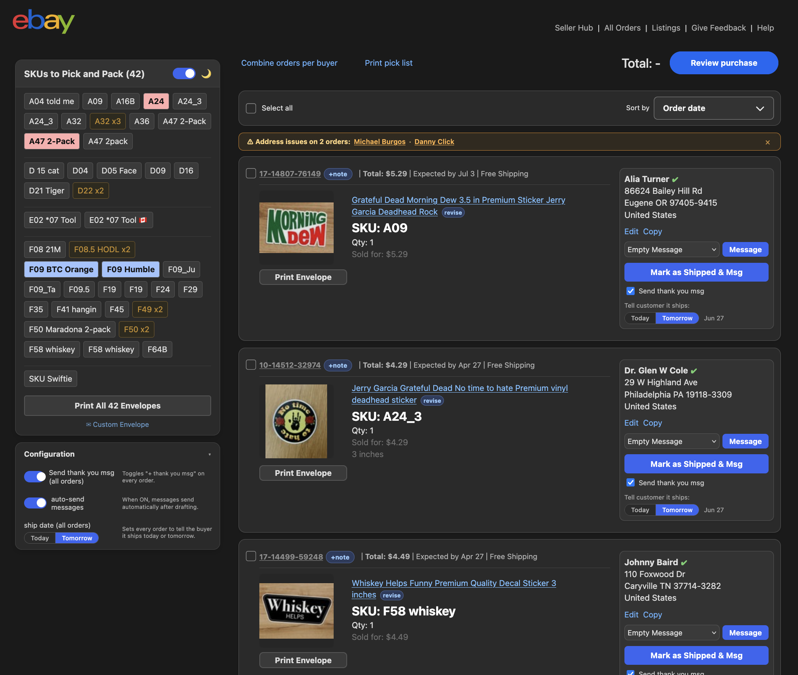

# ⚡ Altheastix eBay Pick & Pack Manager

A Tampermonkey userscript that transforms eBay's bulk shipping interface into a streamlined, fast-paced pick-and-pack workflow tool. No more clunky default UI — just speed.



---

## 🚀 Installation

1. Install the [Tampermonkey](https://www.tampermonkey.net/) browser extension.
2. Click the link below to install the script directly — Tampermonkey will prompt you:
   ```
   https://raw.githubusercontent.com/ellokojavi/ebaypickandpack/main/userscript.js
   ```
3. Navigate to your [eBay Bulk Shipping page](https://www.ebay.com/ship/bulk) and the script activates automatically. ✅

The script self-updates via `@updateURL` / `@downloadURL` pointing to this repo, so Tampermonkey will notify you when a new version is available. 🔔

---

## ✨ Features

### 🎨 UI & Layout
- Full redesign of eBay's bulk shipping page with a clean, modern layout
- **Dark / light mode** toggle 🌙☀️ with preference saved across sessions
- **Custom header navigation** with quick links to Seller Hub, All Orders, Listings, Feedback, and Help
- **Larger product images** (130px) for faster visual identification 🔍
- **Startup countdown overlay** with a "Run Now" shortcut to skip the delay ⏱️

### 🎨 Color-Coded Order Cards
Orders are visually flagged by type at a glance:
- 🟠 **Orange border** — Manila envelope orders
- 🟡 **Yellow border** — Large (LG) items
- 🟢 **Green background + unique per-order color** — Multi-item orders
- 🟤 **Amber/orange pills** — Multi-quantity single-SKU orders (e.g. "B01 x2")

### 📦 SKU Panel
- Floating **"SKUs to Pick and Pack"** side panel listing all SKUs in the current batch
- **Live filter** 🔎 by SKU, buyer name, or item title — updates both the panel and order cards in real-time
- **Click-to-scroll** from any SKU entry directly to its order card
- Alphabetical grouping with visual horizontal separators between letter groups
- Special styling for Manila SKUs, LG SKUs, and multi-quantity SKUs
- Shipped SKUs are visually marked as completed ✅
- **Favicon & tab-title badge** — the browser tab shows the eBay favicon with a white bottom-right box (65% of the icon's width) counting the SKUs still pending in black, and the tab title is prefixed with "(N)"; when everything is shipped, the box turns into a green check

### 🔍 Address Validation
Every order's shipping address is automatically linted against structural rules:
- Minimum line count, buyer name presence, street number format
- Valid `City ST ZIPCODE` line matching eBay's format
- Recognized US state and territory abbreviations 🇺🇸
- **Canadian addresses** 🇨🇦 validated separately: postal code format (`A1A 1A1`) and all 13 province/territory codes
- **PO Box addresses** accepted as valid (skips the street-number rule) 📮
- Addresses with issues show an inline **⚠️ badge** next to the recipient name; hovering reveals a tooltip listing every issue found
- Addresses that pass all rules show an inline **✔️ badge**

### 🖨️ Envelope Printing
- **Print All Envelopes** — consolidates all envelopes into a single print window with one envelope per page (no more N separate dialogs!) 🎉
- **Envelope #10 format** (9.5in × 4.125in) with auto-scaled content
- **Custom Envelope modal** — paste any address block, auto-parse it into editable fields, and print a one-off envelope for orders not in the active queue
- **Canadian envelopes** include a faint 🇨🇦 + "Int'l Stamp" reminder sized to be covered by an international stamp
- Return address fully configurable in `USER_CONFIG`

### 🤖 Order Automation
- **Mark as Shipped** with optional auto-notes and thank-you messages — the button reads **"Mark as Shipped & Msg"** when a thank-you message will go out with the shipment, and **"Mark as Shipped"** when it won't
- **Today / Tomorrow ship control** — an explicit segmented toggle (per order *and* globally) that sets whether the buyer is told the order ships same-day or next-day. "Tomorrow" also adds the internal "Will be shipped on `<date>`" note. Each card shows a live ship-date preview (e.g. "Fri, Jun 27") 📅
- **"Send thank you msg" master switch** — the top-level toggle for messaging; when off, the auto-send and ship-date controls are greyed out since no message will be sent ✉️
- **Add Tracking** — supports both legacy and new eBay tracking systems (v1 + v2) 📬. On the v2 flow the tracking view is filled *and* Save is pressed automatically (auto-continuing past benign carrier/insurance warnings, but pausing on an invalid-number warning). An **"Auto-press Save on eBay"** checkbox in the tracking tooltip (checked by default) lets you turn the auto-submit off and fall back to fill-only
- Tracking is automatically suggested for orders above the configurable dollar threshold (default: $20) 💰
- **Add Note** to orders with custom date formatting 📝
- **Send Messages** to buyers using templated thank-you drafts loaded from the external config file 💌
- Random quotes optionally appended to outgoing messages (configurable) 💬
- **Auto-send toggle** with a safety confirmation step 🛡️

### ✉️ Canned Messages & Templates
- Fully templated messages with variable substitution: `{BUYER_FIRST}`, `{STICKER_NAME}`, `{ARRIVAL_DATE}`, `{SURPRISE_STICKER}`, `{SHIPPING_DATE}`, etc.
- Multiple canned message drafts for backorder, pre-order, and delay scenarios
- Templates and quotes loaded from an **external config file** (`altheastix-ebay-config.js`) so you can update them without touching the script 🧩

### 🧠 Smart Extras
- **Order totals** calculated automatically from item prices and quantities 🧮
- **Canadian order detection** with automatic flagging and delivery note insertion 🇨🇦
- **"Revise" item links** to jump directly to the eBay listing editor ✏️

---

## ⚙️ Configuration

### In-Script (`USER_CONFIG`)

Edit the `USER_CONFIG` object near the top of the script to customize local preferences:

| Key | Default | Description |
|-----|---------|-------------|
| `returnAddress` | Altheastix Seattle address | Return address printed on envelopes |
| `trackingOrderAmountThreshold` | `20` | Orders at or above this dollar amount get a tracking suggestion 💰 |
| `useAlternativeTracking` | `true` | Use the newer eBay v2 tracking system |
| `scriptLoadDelay` | `15000` | Startup delay in milliseconds before the script runs ⏱️ |
| `defaultTrackingNumber` | pre-filled value | Default tracking number pre-filled in the tracking input |
| `enableDarkModeByDefault` | `true` | Start in dark mode 🌙 |
| `enableQuotesInMessages` | `true` | Append a random quote to outgoing thank-you messages 💬 |
| `orderColors` | 40-color palette | Colors used for multi-item order card backgrounds 🌈 |
| `headerLinks` | Seller Hub, Orders, etc. | Quick-nav links rendered in the page header 🔗 |

### 🧩 External Config (`altheastix-ebay-config.js`)

Templates, delivery notes, quotes, and quote keywords are loaded at runtime from `altheastix-ebay-config.js`, which lives in this repo and is pulled in via the script's `@require` line:

```
https://raw.githubusercontent.com/ellokojavi/ebaypickandpack/main/altheastix-ebay-config.js
```

Because the `@require` points at the `main` branch raw URL (no commit hash), the script always fetches the latest version — editing the config file and pushing is enough to update messaging without touching the userscript. The file is structured as:

```javascript
window.AltheastixConfig = {
    messageTemplates: {
        thankYouDrafts: ["Hi {BUYER_FIRST}, thanks for your order! ..."]
    },
    deliveryNotes: {
        canada: "Orders to Canada may take several weeks...",
        usualPlural: "They usually arrive within 5–7 business days",
        usualSingular: "It usually arrives within 5–7 business days",
        patienceVariants: ["thanks for your patience."]
    },
    quotes: { keyword: ["quote1", "quote2"] },
    quoteKeywords: { itemTitle: "keyword" }
};
```

If the config file fails to load, the script falls back to built-in defaults and logs a warning in the browser console. 🛟

---

## 🌐 Pages Supported

| URL Pattern | Purpose |
|-------------|---------|
| `ebay.com/ship/bulk*` | 📦 Main bulk shipping / pick-and-pack page |
| `gslblui.ebay.com/gslblui/bulk` | 📦 Alternate bulk shipping URL |
| `ebay.com/mesh/ord/details*` | 🔎 Order detail page (tracking automation) |
| `ebay.com/om/shipment/update*` | 📬 Shipment update page |
| `ebay.com/ship/trk/*` | 🚚 Tracking page |
| `ebay.com/ship/tr/update*` | 🚚 Tracking update page |

---

## 🔄 Auto-Sync

This repo is connected to a local folder via a launchd watcher (`autopush.sh` + `com.altheastix.autopush.plist`). Any save to `userscript.js` or `altheastix-ebay-config.js` triggers an automatic `git commit` and `git push` — no manual uploads needed. The watcher also stages `CHANGELOG.md` and `README.md` so the changelog and docs ride along in the same commit. 🪄

---

## 💖 Credits

Built by Javier, with modifications from Grok, Gemini, and GitHub Copilot ❤️
