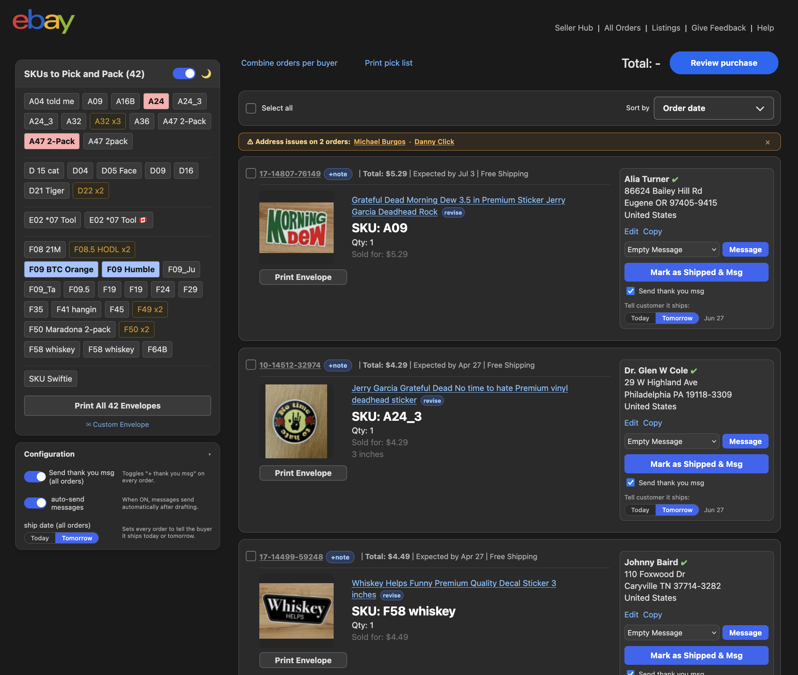

# ⚡ Altheastix eBay Pick & Pack Manager

A Tampermonkey userscript that transforms eBay's bulk shipping interface into a streamlined, fast-paced pick-and-pack workflow tool. No more clunky default UI — just speed.



---

## 🚀 Installation

1. Install the [Tampermonkey](https://www.tampermonkey.net/) browser extension.
2. Click the link below to install the script directly — Tampermonkey will prompt you:
   ```
   https://raw.githubusercontent.com/ellokojavi/ebaypickandpack/main/userscript.js
   ```
3. Navigate to your [eBay Bulk Shipping page](https://www.ebay.com/ship/bulk) and the script activates automatically. ✅

The script self-updates via `@updateURL` / `@downloadURL` pointing to this repo, so Tampermonkey will notify you when a new version is available. 🔔

---

## ✨ Features

### 🎨 UI & Layout
- Full redesign of eBay's bulk shipping page with a clean, modern layout
- **Dark / light mode** toggle 🌙☀️ with preference saved across sessions — the switch lives in the header of the *Defaults for all orders* panel, so it stays reachable while that panel is collapsed
- **Custom header navigation** with quick links to Seller Hub, All Orders, Listings, Feedback, and Help
- **Larger product images** (130px) for faster visual identification 🔍, with **click-to-zoom** — clicking a thumbnail opens it at 3× in a full-screen overlay, dismissed by the × or by clicking the backdrop
- **Startup countdown overlay** with a "Run Now" shortcut to skip the delay ⏱️
- **Buyer notes surfaced** 💬 — any note a buyer left on their order (normally hidden with eBay's grouping summary) is shown as a soft callout under the card's shipping info line
- **Back-to-top button** ⬆️ — a floating ↑ appears beside the order list once you scroll past 200px and returns you to the top of the batch
- **Floating panels track the page** — the SKU panel, the defaults panel and the batch-ship dock reposition themselves as you scroll and as the order column resizes, so they never overlap the cards

### 🎨 Color-Coded Order Cards
Orders are visually flagged by type at a glance:
- 🟠 **Orange border** — Manila envelope orders
- 🟡 **Yellow border** — Large (LG) items
- 🟢 **Green background + unique per-order color** — Multi-item orders
- 🟤 **Amber/orange pills** — Multi-quantity single-SKU orders (e.g. "B01 x2")

### 📦 SKU Panel
- Floating **"SKUs to Pick and Pack"** side panel listing all SKUs in the current batch
- **Live filter** 🔎 by SKU, buyer name, or item title — updates both the panel and order cards in real-time
- **Click-to-scroll** from any SKU entry directly to its order card
- Alphabetical grouping with visual horizontal separators between letter groups
- Special styling for Manila SKUs, LG SKUs, and multi-quantity SKUs
- Shipped SKUs are visually marked as completed ✅
- **Favicon & tab-title badge** — the browser tab shows the eBay favicon with a semi-transparent white bottom-right box (65% of the icon's width) counting the SKUs still pending in black, and the tab title is prefixed with "(N)"; when everything is shipped, the box turns into a green check
- **🔔 New-order watch** — the page is a snapshot and never refreshes itself, so every 5 minutes the script checks eBay's own awaiting-shipment list in the background. When a sale lands after the page was loaded, a "🔔 N new orders since load" pill appears under the panel title (and "— 🔔N new" is appended to the tab title); click it to reload. It never reloads on its own, refuses to reload mid-batch, pauses while a batch ship or automation tab is running, and stays silent on any inconclusive response rather than raising a false alarm
- **Watch status line** — a thin `· checked 2m ago · check now` line under the pill slot, so the watcher's silence is never ambiguous. It goes amber when a check has failed, is backed off, or hasn't succeeded in more than two intervals. `check now` forces an immediate check (debounced to 20s). Not a countdown — it refreshes on each poll and on a lazy 30s timer 🩺

### ☑️ Batch Selection Filters

Next to eBay's native **Select all**, in the batch bar above the order list:

| Control | Selects |
|---------|---------|
| `Select standard envelope (N)` | Plain-envelope orders only: no eBay label, no manila, no LG |
| `Select 🇨🇦 Canada (N)` | Every order shipping to Canada |

Each filter carries its own checkbox showing whether it is **currently** the
active selection — ticked when the selection is exactly that filter's set,
indeterminate when it's a subset, clear otherwise. The state is derived from the
live selection on every change, so unticking one order by hand drops the box
straight away. Clicking a ticked filter clears the selection.

Each filter **replaces** the current selection rather than adding to it, so the
SKU panel and the "Print N Selected Envelopes" button always reflect exactly one
filter's worth of work. Already-shipped orders are excluded from both the counts
and the selection. A filter with nothing to match stays visible but is
**disabled**, showing `(0)` and a tooltip explaining why — so the bar never
changes shape underneath you.

### 🔍 Address Validation
Every order's shipping address is automatically linted against structural rules:
- Minimum line count, buyer name presence, street number format
- Valid `City ST ZIPCODE` line matching eBay's format
- Recognized US state and territory abbreviations 🇺🇸
- **US addresses** get an explicit "United States" country line appended (eBay omits it for domestic orders), so copied/printed addresses are complete; international orders keep eBay's own country line
- **Canadian addresses** 🇨🇦 validated separately: postal code format (`A1A 1A1`) and all 13 province/territory codes
- **PO Box addresses** accepted as valid (skips the street-number rule) 📮
- Addresses with issues show an inline **⚠️ badge** next to the recipient name; hovering reveals a tooltip listing every issue found
- Addresses that pass all rules show an inline **✔️ badge**

### 🖨️ Envelope Printing
- **Print All Envelopes** — consolidates all envelopes into a single print window with one envelope per page (no more N separate dialogs!) 🎉
- **Label vs. envelope split** — orders above `trackingOrderAmountThreshold` ship with an eBay label (with tracking) rather than a hand-addressed envelope. The split is derived from the order total alone: those orders get a `+tracking` link and are excluded from the *Select standard envelope* filter, keeping them out of the bulk envelope run. (Up to v4.35 a clickable `📦 label` pill let each order be reclassified by hand; it was removed in v4.36.)
- **Envelope #10 format** (9.5in × 4.125in) with auto-scaled content
- **Large-envelope format** — orders tagged **LG** (SKU containing `lg`, the blue-highlighted cards) print on a **7in × 5in** landscape page instead, with a slightly smaller address block so long street lines don't wrap. Manila orders stay on #10. A batch mixing both sizes still prints as a single job via CSS named pages 📐
- **Envelope size picker** in the Custom Envelope modal (`#10` / `Large`, defaulting to #10)
- **`altheastixEnvelopeReport()`** — console diagnostic listing every order card with the envelope format it would print on, no dialog opened 🔍
- **Buy shipping label** 🏷️ — a link under each card's Print Envelope button opens eBay's single-label page in a focused tab and auto-fills it for an **eBay Standard Envelope**: Custom size, 1 oz, 9 × 4.1 × 0.1 in. You just click "Buy shipping label" to confirm
- **Custom Envelope modal** — paste any address block, auto-parse it into editable fields, and print a one-off envelope for orders not in the active queue
- **Canadian envelopes** include a faint 🇨🇦 + "Int'l Stamp" reminder sized to be covered by an international stamp
- Return address fully configurable in `USER_CONFIG`

### 🤖 Order Automation
- **Mark as Shipped** with optional auto-notes and thank-you messages — the button reads **"Mark as Shipped & Msg"** when a thank-you message will go out with the shipment, and **"Mark as Shipped"** when it won't
- **Undo while it's in flight** ↩️ — the "marked as shipped — confirming…" overlay carries an **Undo** button that returns the card to its untouched state and cancels its confirmation deadline, for the click you regretted a second later
- **Status read from eBay, not inferred** 🔎 — when the "Mark as shipped" button doesn't appear, the script reads eBay's own order **progress stepper** rather than assuming the order already shipped. eBay renames that step as the order progresses ("Ship by Aug 26" → "Shipped Aug 23"), and both states are recognised. Shipped → confirmed, with eBay's ship date recorded. Not shipped → a genuine failure that quotes eBay back at you (*eBay shows "Ship by Aug 26"*), with the tab left open so you can look
- **Three honest ship states** 🚦 — a card is *pending* (amber spinner, "marked as shipped — confirming…"), *confirmed* (green **✓ Shipped**), or *failed* (red banner with **Retry**, **Open** and dismiss). A shipment that never comes back from eBay can no longer sit looking like a success: the automation tab reports its own timeout, and the pick-and-pack page runs an independent deadline that still fires if the tab was closed or never loaded. A confirmation arriving late always wins, so a merely-slow eBay resolves to shipped. The favicon/tab counter now counts only *confirmed* shipments
- **Ship N Selected Orders** 🚚 — batch shipping driven by the same checkboxes as *Print N Selected*. Orders run **one at a time**, each waiting for a real outcome before the next begins (the thank-you message tab takes focus, so several at once would fight over the browser). A pre-flight dialog shows how many orders, how many messages and roughly how long before anything happens, and a progress dock tracks shipped / failed / skipped with **Stop after this one** and **Retry N failed**. The button appears only when orders are checked — there is no "Ship All". Turn the global **thank you msg** toggle off to keep every tab in the background and the browser usable during a run
- **Retry is safe** — the "will ship" note and the thank-you message are sent once per order and guarded, so retrying a failed *shipment* never sends the buyer a duplicate message
- **End-of-batch message rescue sweep** 🧹 — when a batch finishes with orders shipped but buyers un-messaged, the script reopens the message tab once for each card still showing a retryable failure, in the **background** so it doesn't drag you back to the browser. Exactly one attempt per card per batch (the marker is written before the tab opens, so nothing can loop into mailing the same buyer twice), skipped entirely if you stopped the batch by hand, and the closing dock line reports what it did — `· 2/3 messages recovered, 1 still needs you`. Anything that fails a second time keeps its pill and is yours to finish
- **Message outcomes are reported too** ✉️ — an order can ship perfectly and still leave the buyer with nothing if eBay's composer fails to open. A card that shipped but couldn't message now shows an amber **"✉ Message not sent"** pill with **Retry** and **Open**, instead of an unqualified green tick. The queued draft survives a failed attempt (it's only consumed once the text is actually in the box), so Retry genuinely re-sends the same message — and a message tab whose composer never opens reloads itself once and tries again before giving up
- **Today / Tomorrow ship control** — an explicit segmented toggle (per order *and* globally, and remembered between sessions) that sets whether the buyer is told the order ships same-day or next-day. "Tomorrow" also adds the internal "Will be shipped on `<date>`" note. Each card shows a live ship-date preview (e.g. "Fri, Jun 27") 📅
- **Sunday is never a ship date** 📆 — the computed "tomorrow" date rolls forward to Monday if it lands on a Sunday, so a Saturday batch tells the buyer Monday rather than a day nothing ships
- **"Send thank you msg" master switch** — the top-level toggle for messaging; when off, the auto-send and ship-date controls are greyed out since no message will be sent ✉️
- **Defaults that stick** 💾 — the *Defaults for all orders* panel — a floating panel under the SKU list, collapsed by default — holds the thank-you, auto-send and ship-date globals. It stores every setting and re-reads it on each rebuild. Changing a global applies it to every card; after that, per-order overrides survive repaints, so ticking a checkbox or confirming a shipment no longer silently reverts what you set. Only cards the script has never seen get the defaults applied
- **Add Tracking** — supports both legacy and new eBay tracking systems (v1 + v2) 📬. On the v2 flow the tracking view is filled *and* Save is pressed automatically (auto-continuing past benign carrier/insurance warnings, but pausing on an invalid-number warning). An **"Auto-press Save on eBay"** checkbox in the tracking tooltip (checked by default) lets you turn the auto-submit off and fall back to fill-only
- Tracking is automatically suggested for orders above the configurable dollar threshold (default: $25) 💰
- **Show postage cost on label → No** is forced automatically whenever eBay's "Edit labels" modal opens, so the postage amount is never printed on the label 🏷️
- **Add Note** to orders with custom date formatting 📝
- **Send Messages** to buyers using templated thank-you drafts loaded from the external config file 💌
- Random quotes optionally appended to outgoing messages (configurable) 💬
- **Auto-send toggle** with a safety confirmation step 🛡️ — remembers your last choice across page loads rather than resetting itself
- **Verified auto-send** — the message tab retries the Send click and only closes once the send is confirmed. If it can't confirm, it leaves the tab open with the draft in place and a red banner explaining what went wrong, instead of closing silently ✅

### ✉️ Canned Messages & Templates
Two different sets of templates, filled from two different variable sets:

**Thank-you drafts** (`messageTemplates.thankYouDrafts` in the external config) — sent automatically with a shipment:

| Variable | Filled with |
|----------|-------------|
| `{BUYER_NAME}` / `{BUYER_FIRST}` | Buyer's full name / first name |
| `{SHIP_DATE}` | The card's Today/Tomorrow ship date, e.g. "Fri, Jun 27" |
| `{STICKER_WORD}` | The product noun, matched to the order: "sticker"/"stickers", "magnet"/"magnets", or "goodies" for a mixed order |
| `{PRONOUN_SUBJ}` / `{PRONOUN_OBJ}` / `{DEMONSTRATIVE}` | "it"/"they", "it"/"them", "this"/"these" — agreeing with that same quantity |
| `{DELIVERY_NOTE}` | The Canada note for Canadian orders, otherwise the usual-arrival line plus a random patience variant |
| `{TRACKING_NOTE}` | "To keep prices fair, orders at or under $25 ship without tracking." — **empty** for orders above `trackingOrderAmountThreshold`, since those ship with a label |

**Manual canned drafts** — picked from the dropdown under each card's *Message* button. These three live in the userscript itself (`CONFIG.manualMessageDrafts`), not in the external config:

| Option | Scenario | Variables |
|--------|----------|-----------|
| **Late + Gift** | Out of stock, offering a free sticker for the wait | `{BUYER_FIRST}`, `{STICKER_NAME}`, `{ARRIVAL_DATE}`, `{SURPRISE_STICKER}` |
| **Late, no gift** | Out of stock, no gift offered | `{BUYER_FIRST}`, `{STICKER_NAME}`, `{ARRIVAL_DATE}` |
| **Preorder Sticker** | Pre-order that hasn't shipped yet | `{BUYER_FIRST}`, `{STICKER_NAME}`, `{SHIPPING_DATE}` |

- **ALL-CAPS buyer names are normalized** — eBay hands over names like `GEORGE MCDONALD`; the greeting reads "George McDonald" so the message doesn't look machine-generated. Names that already contain a lowercase letter are left exactly as typed, preserving intentional casing ✍️
- **Editable live preview** — the customize-message modal shows the fully interpolated message as you type, and you can click into the preview to hand-edit any part of the final text before sending (a reset link restores template sync) ✍️
- Thank-you drafts, delivery notes and quotes are loaded from an **external config file** (`altheastix-ebay-config.js`) so you can update them without touching the script 🧩. If it fails to load, each falls back to a built-in default

### 🧠 Smart Extras
- **Order totals** calculated automatically from item prices and quantities, with totals over the dollar threshold (default: $25) highlighted to stand out 🧮
- **Canadian order detection** with automatic flagging and delivery note insertion 🇨🇦
- **"Revise" item links** to jump directly to the eBay listing editor ✏️

---

## ⚙️ Configuration

### In-Script (`USER_CONFIG`)

Edit the `USER_CONFIG` object near the top of the script to customize local preferences:

| Key | Default | Description |
|-----|---------|-------------|
| `returnAddress` | Altheastix Seattle address | Return address printed on envelopes |
| `trackingOrderAmountThreshold` | `25` | Orders **above** this dollar amount ship with an eBay label: they get the `+tracking` link, a highlighted total, an empty `{TRACKING_NOTE}`, and are excluded from the *Select standard envelope* filter 💰 |
| `useAlternativeTracking` | `true` | Use the newer eBay v2 tracking system |
| `scriptLoadDelay` | `15000` | Startup delay in milliseconds before the script runs ⏱️ |
| `defaultTrackingNumber` | pre-filled value | Default tracking number pre-filled in the tracking input |
| `enableDarkModeByDefault` | `true` | Start in dark mode 🌙 |
| `enableQuotesInMessages` | `true` | Append a random quote to outgoing thank-you messages 💬 |
| `automationTabTimeoutSeconds` | `45` | How long a background automation tab may run before it flags itself instead of closing ⏱️ |
| `enableOrderWatch` | `true` | Poll eBay in the background for orders that arrived after page load 🔔 |
| `orderWatchIntervalMinutes` | `5` | Minutes between background checks (backs off to 15 on repeated failures) ⏲️ |
| `orderColors` | 40-color palette | Colors used for multi-item order card backgrounds 🌈 |
| `headerLinks` | Seller Hub, Orders, etc. | Quick-nav links rendered in the page header 🔗 |

### 🧩 External Config (`altheastix-ebay-config.js`)

Thank-you drafts, delivery notes, quotes, and quote keywords are loaded at runtime from `altheastix-ebay-config.js`, which lives in this repo and is pulled in via the script's `@require` line:

```
https://raw.githubusercontent.com/ellokojavi/ebaypickandpack/main/altheastix-ebay-config.js
```

Because the `@require` points at the `main` branch raw URL (no commit hash), the script always fetches the latest version — editing the config file and pushing is enough to update messaging without touching the userscript. The file is structured as:

```javascript
window.AltheastixConfig = {
    messageTemplates: {
        thankYouDrafts: ["Hi {BUYER_FIRST}, thanks for your order! ..."]
    },
    deliveryNotes: {
        canada: "Orders to Canada may take several weeks...",
        usualPlural: "They usually arrive within 5–7 business days",
        usualSingular: "It usually arrives within 5–7 business days",
        patienceVariants: ["thanks for your patience."]
    },
    quotes: { keyword: ["quote1", "quote2"] },
    quoteKeywords: { itemTitle: "keyword" }
};
```

If the config file fails to load, the script falls back to built-in defaults and logs a warning in the browser console. 🛟

---

## 🔧 Console Diagnostics

Helpers are exposed on the pick-and-pack page for checking what the shipping
logic, the defaults panel and the order watch are actually doing. Open the
browser console on the bulk shipping page and run:

| Command | What it does |
|---------|--------------|
| `altheastixShipReport()` | Prints the batch queue state, every order card's ship state (`idle` / `pending` / `confirmed` / `failed`) and a rolling 300-entry event log |
| `altheastixShipReport(true)` | Same, and copies the whole report to the clipboard for pasting elsewhere |
| `altheastixShipSimulate('fail', 'order-item-3')` | Drives card 3 into the failed state — red banner, Retry button, counter update — **without contacting eBay** |
| `altheastixShipSimulate('confirm', 'order-item-3')` | Drives card 3 into the confirmed state |
| `altheastixShipSimulate('pending', 'order-item-3')` | Shows the "queued for batch shipping" badge |
| `altheastixShipSimulate('msgfail', 'order-item-3')` | Raises a real retryable "message not sent" pill on card 3 — **without contacting eBay** |
| `altheastixShipSimulate('reset', 'order-item-3')` | Returns card 3 to its untouched state |
| `altheastixShipSweepPreview()` | Lists which cards the end-of-batch message rescue sweep would retry, and which failed cards it would skip and why. Opens nothing |
| `altheastixConfigReport()` | Prints the stored panel defaults (thank-you, auto-send, ship date) next to every card's live state, flagging which cards carry a per-order override |
| `altheastixConfigDryRun()` | Reports which cards the **next** repaint would seed with the defaults and which it would leave alone — changes nothing |
| `altheastixWatchReport()` | Prints the order-watch state — baseline size, last poll result, next poll countdown, ids seen since load — plus a rolling 200-entry event log |
| `altheastixWatchReport(true)` | Same, and copies the report to the clipboard |
| `altheastixWatchSimulate('new', 2)` | Fakes two new orders so the pill and tab title can be checked — **without contacting eBay** |
| `altheastixWatchSimulate('clear')` | Clears the pill and starts the window over |
| `altheastixWatchSimulate('stale')` | Paints the amber "last check failed" status line — clears itself on the next good poll |
| `altheastixWatchSimulate('fresh')` | Returns the status line to its quiet state |
| `altheastixWatchSimulate('poll')` | Forces one real check right now and prints the report |

The simulators and dry runs only inspect or manipulate the page's own state
machine — they never open an automation tab, mark anything shipped on eBay, or
message a buyer. 🧪

---

## 🌐 Pages Supported

| URL Pattern | Purpose |
|-------------|---------|
| `ebay.com/ship/bulk*` | 📦 Main bulk shipping / pick-and-pack page |
| `gslblui.ebay.com/gslblui/bulk` | 📦 Alternate bulk shipping URL |
| `ebay.com/mesh/ord/details*` | 🔎 Order detail page (tracking automation) |
| `ebay.com/om/shipment/update*` | 📬 Shipment update page |
| `ebay.com/ship/trk/*` | 🚚 Tracking page |
| `ebay.com/ship/tr/update*` | 🚚 Tracking update page |
| `ebay.com/ship/single/*` | 🏷️ Single shipping-label page (Buy label auto-fill) |

---

## 🧩 Companion Userscripts

Two standalone scripts live in this repo alongside the main userscript. Each installs on its own and covers a job that happens outside the bulk shipping page — full write-up in **[docs/companion-userscripts.md](docs/companion-userscripts.md)**.

| Script | Runs on | What it does |
|--------|---------|--------------|
| `offer-msg-picker.user.js` | eBay Active Listings → **Send offer** modal | Dropdown of 10 marketing message templates, with the discount % read from the offer form and filled into the text (never a hard-coded 10%). An editable % box overrides it, and the message updates live when the discount changes. Mounts outside eBay's React nodes so typing in the message box keeps focus ⌨️ |
| `print-address-gmail.user.js` | Gmail (`mail.google.com`) | Adds a **🖨 Print address** button to Etsy/eBay order emails and prints a #10 envelope with the buyer's address and the Altheastix return address. Parses the address out of the rendered email (Gmail strips `<address>` tags), offers an edit panel, and prints from the Gmail tab itself — no extra window to close ✉️ |

---

## 🔄 Auto-Sync

This repo is connected to a local folder via a launchd watcher (`autopush.sh` + `com.altheastix.autopush.plist`). Any save to `userscript.js` or `altheastix-ebay-config.js` triggers an automatic `git commit` and `git push` — no manual uploads needed. The watcher also stages `CHANGELOG.md` and `README.md` so the changelog and docs ride along in the same commit. 🪄

---

## 💖 Credits

Built by Javier, with modifications from Grok, Gemini, Claude, and GitHub Copilot ❤️

Every release is written up in **[CHANGELOG.md](CHANGELOG.md)** — what changed, and why. 📝
