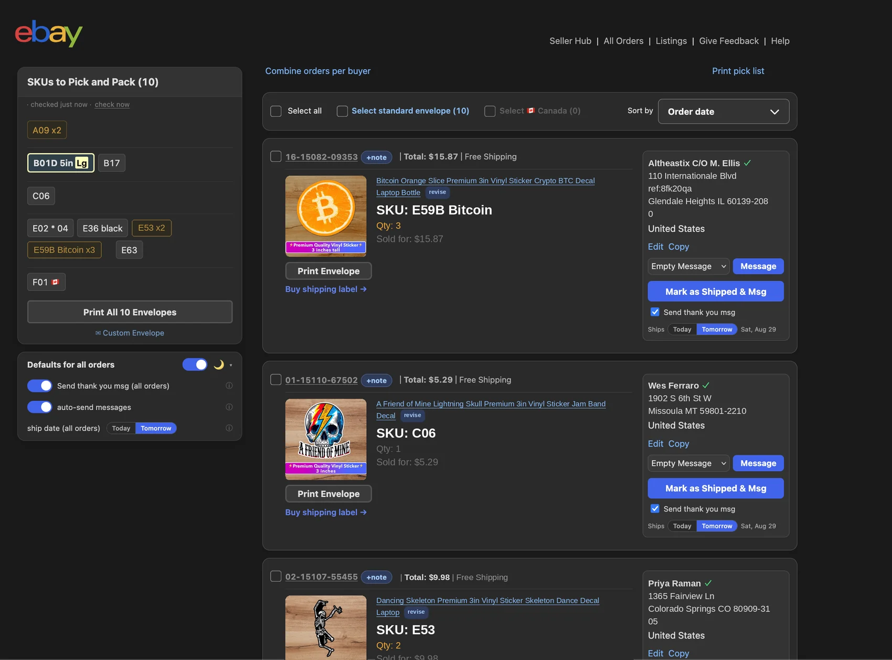
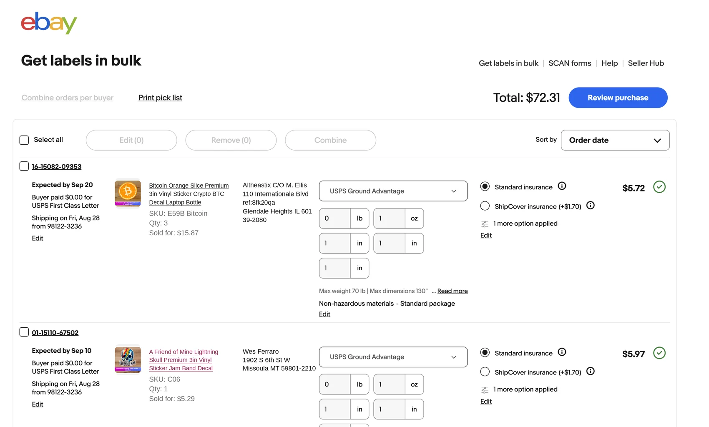

# ⚡ Altheastix eBay Pick & Pack Manager

A single Tampermonkey userscript that rebuilds eBay's bulk shipping page
(`ebay.com/ship/bulk`) into a pick-and-pack workflow tool: a picking route
instead of an order list, printable envelopes instead of bought labels,
validated addresses, and shipping automation that tells you when it failed.

**📖 Full write-up, with live interactive demos of every subsystem:
[ellokojavi.github.io/ebaypickandpack](https://ellokojavi.github.io/ebaypickandpack/)**



| | |
|---|---|
| **Current version** | v4.44 (`20260902-v4.44-envelope-blank-page`) |
| **Size** | ~6,800 lines, one file |
| **Runs on** | 7 eBay page patterns — see [Pages supported](#pages-supported) |
| **Built for** | [Altheastix](https://www.ebay.com/str/altheastix), a one-person sticker shop shipping ~350 items a month |

---

## Contents

- [Why this exists](#why-this-exists)
- [Requirements](#requirements)
- [Installation](#installation)
- [What's in this repo](#whats-in-this-repo)
- [Features](#features)
- [Configuration](#configuration)
- [Console diagnostics](#console-diagnostics)
- [Pages supported](#pages-supported)
- [Companion userscripts](#companion-userscripts)
- [Known limitations](#known-limitations)
- [Development](#development)
- [Changelog and credits](#changelog-and-credits)

---

## Why this exists

eBay's bulk shipping page is built to **buy postage**. It gives every order a
weight box, three dimension boxes, a service dropdown and an insurance radio,
and totals what you owe at the top. For ~$5 stickers none of that matters —
shipping is one ounce and almost always the same envelope.

The two fields that decide what you physically go and fetch, **SKU and
quantity**, are 12px grey text under the item title. Everything else about
packing is missing entirely.

| What packing needs | What eBay's page gives |
|---|---|
| Which box the sticker is in | SKU, 12px grey, under the title |
| How many to count out | "Qty: 3", same grey, same size |
| One list of everything to pick | A pick list, per order |
| Printable addresses for a home printer | None — labels are bought, not printed |
| Which orders need a manila envelope | None — open each one and read it |
| Orders that arrived since page load | None — the page is a snapshot |
| What's already packed | None |

An order at Altheastix is a trip to a container, a count, a ziplock, an
envelope, a postage decision and a walk to the mailbox — eight physical steps.
The script rebuilds the page around those steps rather than around eBay's data
model, and cuts daily order processing from about **45 minutes to about 12**.

<table>
<tr><td width="50%"><b>Before</b> — eBay's stock "Get labels in bulk"</td>
<td width="50%"><b>After</b> — the same URL, rebuilt in the browser</td></tr>
<tr><td></td>
<td></td></tr>
</table>

Same URL, same orders, same eBay session. Nothing is proxied or scraped
server-side — the script replaces the layout in the browser after eBay has
rendered it.

---

## Requirements

- **[Tampermonkey](https://www.tampermonkey.net/)** — the script relies on
  `GM_setValue` / `GM_getValue`, `GM_addValueChangeListener`, `GM_openInTab`,
  `GM_xmlhttpRequest`, `GM_addStyle`, `GM_setClipboard`, `unsafeWindow` and
  `window.close`. Greasemonkey is untested.
- **Firefox or a Chromium browser.** Day-to-day use is on Firefox; the print
  paths are tuned against Chromium's page-break behaviour and both are exercised.
- **A logged-in eBay seller session.** Everything runs as you, in your own
  browser, against pages you are already authorised to see.
- **Network access to `raw.githubusercontent.com`**, for the `@require` config
  file and for script self-updates.

---

## Installation

1. Install the [Tampermonkey](https://www.tampermonkey.net/) browser extension.
2. Open the raw script and let Tampermonkey prompt you to install:
   **[userscript.js](https://raw.githubusercontent.com/ellokojavi/ebaypickandpack/main/userscript.js)**
3. Edit `USER_CONFIG` at the top of the installed script — at minimum the
   **return address** and the **tracking threshold**. See
   [Configuration](#configuration).
4. Open your [eBay bulk shipping page](https://www.ebay.com/ship/bulk). The
   script waits 15 seconds for eBay to finish rendering, showing a countdown
   overlay with a **Run Now** shortcut, then takes over the layout.

`@updateURL` and `@downloadURL` point at this repo's `main` branch, so
Tampermonkey offers each new version as it lands.

---

## What's in this repo

| File | What it is |
|---|---|
| `userscript.js` | The whole pick-and-pack tool. One file, no build step |
| `altheastix-ebay-config.js` | Message templates, delivery notes and quotes, pulled at runtime via `@require` so wording changes without touching the script |
| `offer-msg-picker.user.js` | Companion script — message picker in eBay's Send Offer modal |
| `print-address-gmail.user.js` | Companion script — print a #10 envelope from a Gmail order email |
| `CHANGELOG.md` | Every version, what changed and why |
| `docs/index.html` | The project website (GitHub Pages) |
| `docs/companion-userscripts.md` | Full write-up of the two companion scripts |

---

## Features

### Layout

- Full redesign of eBay's bulk shipping page. The grouping summary,
  delivery-service cells, proof-of-delivery column and pay actions are hidden;
  the logo moves into a single header row.
- **Dark / light mode** with the preference saved across sessions — the switch
  lives in the header of the *Defaults for all orders* panel, so it stays
  reachable while that panel is collapsed (its default state).
- **Custom header navigation** with quick links to Seller Hub, All Orders,
  Listings, Feedback and Help.
- **Larger product images** (130px) with **click-to-zoom** — clicking a
  thumbnail opens it at 3× in a full-screen overlay, dismissed by the × or by
  clicking the backdrop.
- **Startup countdown overlay** with a "Run Now" shortcut to skip the delay.
- **Buyer notes surfaced** — any note a buyer left on their order (normally
  hidden inside eBay's grouping summary) appears as a soft callout under the
  card's shipping info line.
- **Back-to-top button** — a floating ↑ appears beside the order list once you
  scroll past 200px.
- **Floating panels track the page** — the SKU panel, the defaults panel and the
  batch-ship dock reposition as you scroll and as the order column resizes, so
  they never overlap the cards.

### Colour-coded order cards

Colour is physical, not decorative. An order with two or more SKUs takes its own
colour from a 40-colour palette, and every one of its pills in the SKU panel
carries that colour, so pills going into the same envelope read as one group
even when they sit in different boxes.

- **Orange border** — manila envelope orders
- **Yellow border** — large (LG) items, which need a different envelope
- **Green background + a unique per-order colour** — multi-item orders
- **Amber pills** — multi-quantity single-SKU orders (e.g. `B01 ×2`), the single
  most common packing mistake

### SKU panel

The SKU is a shelf address: `F24` is the 24th sticker in box F. Sorted
alphabetically, the list becomes a walking route — open box A once, take
everything from it, move on.

- Floating **"SKUs to Pick and Pack"** panel listing every order line in the
  batch, one pill per line, sorted by SKU, so each pill points at exactly one
  order.
- **Live filter** by SKU, buyer name or item title — updates both the panel and
  the order cards in real time.
- **Click-to-scroll** from any SKU entry to its order card.
- Alphabetical grouping with horizontal separators between letter groups.
- Special styling for manila, LG and multi-quantity SKUs.
- **Bold yellow `*`** at the end of any pill whose order ships with tracking —
  the same `#ffd54f` as the yellow `Total:` pill on the card, driven by the same
  `trackingOrderAmountThreshold` test, so the tracked-label orders stand out in
  the panel. (On a manila pill in light mode the pill background is that same
  yellow, so the mark doesn't show there.)
- Packed SKUs strike through rather than disappearing, so the list doesn't shift
  under you while you work down it.
- **Favicon and tab-title badge** — the browser tab shows eBay's favicon with a
  semi-transparent white box across the bottom-right (65% of the icon's width)
  counting SKUs still pending, and the title is prefixed with "(N)". When the
  batch is done the box becomes a green check. It counts **confirmed**
  shipments only; a pending or failed order still counts as work to do.
- **New-order watch** — the page is a snapshot and never refreshes itself, so
  every 5 minutes the script asks eBay's own awaiting-shipment endpoint for the
  current order ids and compares them to the ones captured at load. When a sale
  lands mid-session, a "🔔 N new orders since load" pill appears under the panel
  title (and "— 🔔N new" is appended to the tab title); clicking it is the
  reload. It never reloads on its own, refuses mid-batch, pauses while a batch
  ship or automation tab is running, counts additions only, and stays silent on
  an inconclusive response rather than raising a false alarm.
- **Watch status line** — a thin `· checked 2m ago · check now` line under the
  pill slot, so the watcher's silence is never ambiguous. It goes amber when a
  check has failed, is backed off, or hasn't succeeded in more than two
  intervals. `check now` forces an immediate check (debounced to 20s).

### Batch selection filters

Next to eBay's native **Select all**, in the batch bar above the order list:

| Control | Selects |
|---|---|
| `Select standard envelope (N)` | Plain-envelope orders only: no eBay label, no manila, no LG |
| `Select 🇨🇦 Canada (N)` | Every order shipping to Canada |

Each filter carries its own checkbox showing whether it is **currently** the
active selection — ticked when the selection is exactly that filter's set,
indeterminate when it's a subset, clear otherwise. The state is derived from the
live selection on every change, so unticking one order by hand drops the box
straight away. Clicking a ticked filter clears the selection.

Each filter **replaces** the current selection rather than adding to it, so the
SKU panel and the "Print N Selected Envelopes" button always reflect exactly one
filter's worth of work. Already-shipped orders are excluded from both the counts
and the selection. A filter with nothing to match stays visible but is
**disabled**, showing `(0)` and a tooltip explaining why — so the bar never
changes shape underneath you.

### Address validation

A stamped envelope is an expensive place to discover a bad address. Every
address is linted against structural rules before it can be printed:

- Minimum line count, a buyer name that isn't a number, a street line starting
  with a house number.
- A valid `City ST 12345` line, and a real US state or territory code — all 59
  of them, including the military ones.
- **PO Box addresses** accepted as valid (the street-number rule is skipped).
- **Canadian addresses** checked separately: postal-code format (`A1A 1A1`) and
  all 13 province and territory codes. Other international destinations are
  skipped — too many valid formats to lint reliably.
- One rule exists for an eBay quirk: a line after the name containing only
  digits means eBay split the street number from the street name, duplicating it.
- **US addresses** get an explicit "United States" country line appended (eBay
  omits it for domestic orders) so printed addresses are complete; international
  orders keep eBay's own country line.
- Addresses with issues show an inline **⚠️ badge** next to the recipient name;
  hovering lists every issue found. Clean addresses show a **✔️ badge**.

### Envelope printing

Three kinds of postage, derived from the order total against one threshold:
a hand-addressed #10 envelope, an international envelope, or an eBay label with
tracking above `trackingOrderAmountThreshold`.

- **Print All Envelopes** — consolidates the whole batch into a single print
  window, one envelope per page, instead of eBay's one dialog per envelope.
- **Label vs. envelope split** — orders above the threshold get a `+tracking`
  link, a highlighted total, an empty `{TRACKING_NOTE}` and exclusion from the
  *Select standard envelope* filter. The split is derived from price rather than
  remembered, so it stays consistent everywhere it appears. (Up to v4.35 a
  clickable `📦 label` pill let each order be reclassified by hand; removed in
  v4.36.)
- **Envelope #10 format** (9.5in × 4.125in) with auto-scaled content.
- **Large-envelope format** — orders tagged **LG** (SKU containing `lg`) print
  on a **7in × 5in** landscape page with a slightly smaller address block so
  long street lines don't wrap. Manila orders stay on #10. A batch mixing both
  sizes still prints as a single job via CSS named pages.
- `ENVELOPE_FORMATS` is the single source of geometry for both sizes. Since
  v4.44 the envelope box is only as tall as the ink it carries, so a printer
  with large hardware margins can't push it onto a blank second page.
- **Envelope size picker** in the Custom Envelope modal (`#10` / `Large`,
  defaulting to #10).
- **Custom Envelope modal** — paste any address block, auto-parse it into
  editable fields, and print a one-off envelope for an order not in the queue.
- **Canadian envelopes** carry a faint 🇨🇦 + "Int'l Stamp" reminder, sized to be
  covered by an international stamp.
- **Buy shipping label** — a link under each card's Print Envelope button opens
  eBay's single-label page in a focused tab and auto-fills it for an eBay
  Standard Envelope: Custom size, 1 oz, 9 × 4.1 × 0.1 in. You click "Buy
  shipping label" to confirm.
- **Show postage cost on label → No** is forced whenever eBay's "Edit labels"
  modal opens, so the postage amount is never printed.
- Return address fully configurable in `USER_CONFIG`.

### Shipping automation

- **Mark as Shipped** with optional auto-notes and thank-you messages. The
  button reads **"Mark as Shipped & Msg"** when a thank-you will go out with the
  shipment, and plain **"Mark as Shipped"** when it won't — the label never
  overstates what the click does.
- **Undo while it's in flight** — the "marked as shipped — confirming…" overlay
  carries an **Undo** button that returns the card to its untouched state and
  cancels its confirmation deadline.
- **Three honest ship states.** A card is *pending* (amber spinner), *confirmed*
  (green **✓ Shipped**), or *failed* (red banner with **Retry**, **Open** and
  dismiss). A shipment that never comes back from eBay can no longer sit looking
  like a success: the automation tab reports its own timeout, and the
  pick-and-pack page runs an independent deadline that still fires if the tab
  was closed or never loaded. A confirmation arriving late always wins, so a
  merely-slow eBay resolves to shipped.
- **Status read from eBay, not inferred.** When the "Mark as shipped" button
  doesn't appear, the script reads eBay's own progress **stepper** rather than
  assuming the order already shipped. eBay renames that step as the order
  progresses ("Ship by Aug 26" → "Shipped Aug 23") and both states are
  recognised, with the match anchored on the `ship` prefix and the icon as a
  second independent signal. Not shipped is a genuine failure that quotes eBay
  back at you — *eBay shows "Ship by Aug 26"* — with the tab left open.
- **Ship N Selected Orders** — batch shipping driven by the same checkboxes as
  *Print N Selected*. Orders run **one at a time**, each waiting for a real
  outcome before the next begins, because the message tab takes focus and
  parallel runs fight over the browser. A pre-flight dialog states the order
  count, message count and estimated duration (30s per order, measured), and a
  progress dock tracks shipped / failed / skipped with **Stop after this one**
  and **Retry N failed**. The button appears only when orders are checked —
  there is no "Ship All". Turning the global **thank you msg** toggle off keeps
  every tab in the background and the browser usable during a run.
- **Button recovery** — two legitimate code paths removed the ship button and
  nothing put it back, leaving cards permanently unshippable. It now rebuilds
  from the card's own order id, wired into all three recovery paths (v4.22).
- **Combined-order watchdog** — eBay re-renders combined cards after the initial
  pass, wiping every injected control. A `MutationObserver` re-processes them,
  stripping stale injections first so nothing duplicates (v4.14).
- **Add Tracking** supports both eBay tracking systems (v1 + v2). On the v2 flow
  the tracking view is filled *and* Save is pressed automatically — auto-
  continuing past benign carrier and insurance warnings, but pausing on an
  invalid-number warning. An **"Auto-press Save on eBay"** checkbox in the
  tracking tooltip (checked by default) falls back to fill-only.
- **Automatic ship notes** — every order marked shipped gets a dated internal
  note: `Shipped on <date>` for same-day, `Will be shipped on <date>` when the
  card is set to Tomorrow. Guarded per order, so a retry never adds it twice.
  Note payloads are keyed by order id, so a batch's background note tabs can't
  overwrite each other.
- **Add Note** to orders with custom date formatting.

### Buyer messages

- **Today / Tomorrow ship control** — an explicit segmented toggle, per order
  and globally, remembered between sessions, that sets whether the buyer is told
  the order ships same-day or next-day. Each card shows a live ship-date preview
  (e.g. "Fri, Jun 27").
- **Sunday is never a ship date** — a computed "tomorrow" that lands on a Sunday
  rolls forward to Monday, because nothing ships on a Sunday.
- **"Send thank you msg" master switch** — when off, the auto-send and ship-date
  controls grey out, since no message will be sent.
- **Composer-native typing** — the draft is inserted by the composer's own
  document (`execCommand('insertText')`), so eBay sees a genuine trusted input
  event rather than one built in the userscript sandbox. The old synthetic path
  is kept as an automatic fallback.
- **Verified auto-send** — the message tab retries the Send click and only
  closes on positive evidence that the message went out. If it can't confirm, it
  leaves the tab open with the draft intact and a red banner explaining what
  went wrong.
- **Retry can never double-send.** The "will ship" note and the thank-you
  message are one-shot side effects guarded by per-order flags, so retrying a
  failed *shipment* never mails the buyer twice. The draft is read and deleted
  separately, with the delete happening only once the text is in the box, so a
  failed attempt leaves the draft intact and Retry sends the same message rather
  than an empty one.
- **Message outcomes are reported separately from shipping.** An order can ship
  perfectly and still leave the buyer with nothing if eBay's composer fails to
  open. A card that shipped but couldn't message shows an amber **"✉ Message not
  sent"** pill with **Retry** and **Open**, instead of an unqualified green
  tick. A message tab whose composer never opens reloads itself once and tries
  again before giving up.
- **End-of-batch message rescue sweep** — when a batch finishes with orders
  shipped but buyers un-messaged, the script reopens the message tab once for
  each card still showing a retryable failure, in the **background** so it
  doesn't drag you back to the browser. Exactly one attempt per card per batch
  (the marker is written *before* the tab opens, so nothing can loop into
  mailing the same buyer twice), skipped entirely if you stopped the batch by
  hand, and the closing dock line reports what it did:
  `· 2/3 messages recovered, 1 still needs you`.
- **Defaults that stick** — the *Defaults for all orders* panel (a floating
  panel under the SKU list, collapsed by default) holds the thank-you, auto-send
  and ship-date globals. Changing a global applies it to every card; after that,
  per-order overrides survive repaints, so ticking a checkbox or confirming a
  shipment no longer silently reverts what you set. Only cards the script has
  never seen get the defaults applied.
- **Auto-send toggle** with a safety confirmation step, remembering your last
  choice across page loads rather than resetting itself.

### Canned messages and templates

Two different sets of templates, filled from two different variable sets.

**Thank-you drafts** (`messageTemplates.thankYouDrafts` in the external config),
sent automatically with a shipment:

| Variable | Filled with |
|---|---|
| `{BUYER_NAME}` / `{BUYER_FIRST}` | Buyer's full name / first name |
| `{SHIP_DATE}` | The card's Today/Tomorrow ship date, e.g. "Fri, Jun 27" |
| `{STICKER_WORD}` | The product noun matched to the order: "sticker"/"stickers", "magnet"/"magnets", or "goodies" for a mixed order |
| `{PRONOUN_SUBJ}` / `{PRONOUN_OBJ}` / `{DEMONSTRATIVE}` | "it"/"they", "it"/"them", "this"/"these" — agreeing with that same quantity |
| `{DELIVERY_NOTE}` | The Canada note for Canadian orders, otherwise the usual-arrival line plus a random patience variant |
| `{TRACKING_NOTE}` | "To keep prices fair, orders at or under $25 ship without tracking." — **empty** above `trackingOrderAmountThreshold`, since those ship with a label |

**Manual canned drafts**, picked from the dropdown under each card's *Message*
button. These three live in the userscript itself (`CONFIG.manualMessageDrafts`),
not in the external config:

| Option | Scenario | Variables |
|---|---|---|
| **Late + Gift** | Out of stock, offering a free sticker for the wait | `{BUYER_FIRST}`, `{STICKER_NAME}`, `{ARRIVAL_DATE}`, `{SURPRISE_STICKER}` |
| **Late, no gift** | Out of stock, no gift offered | `{BUYER_FIRST}`, `{STICKER_NAME}`, `{ARRIVAL_DATE}` |
| **Preorder Sticker** | Pre-order that hasn't shipped yet | `{BUYER_FIRST}`, `{STICKER_NAME}`, `{SHIPPING_DATE}` |

- **ALL-CAPS buyer names are normalised.** eBay hands over names like
  `GEORGE MCDONALD`; the greeting reads "George McDonald", because a
  machine-looking greeting undoes the point of writing one. Names that already
  contain a lowercase letter are left exactly as typed.
- **Editable live preview** — the customise-message modal shows the fully
  interpolated message as you type, every field landing in the preview in green.
  Touch the preview and template sync stops, an "edited by hand" flag appears,
  and what you send is exactly what you see (a reset link restores sync).
- **Random quotes** — an optional musician quote appended to outgoing messages,
  keyed off the item title where a keyword matches.

### Smart extras

- **Order totals** calculated from item prices and quantities, with totals over
  the threshold highlighted.
- **Canadian order detection** with automatic flagging and delivery-note
  insertion.
- **"Revise" item links** to jump straight to the eBay listing editor.

---

## Configuration

### In-script (`USER_CONFIG`)

Edit the `USER_CONFIG` object near the top of the script:

| Key | Default | Description |
|---|---|---|
| `returnAddress` | Altheastix Seattle address | Return address printed on envelopes |
| `trackingOrderAmountThreshold` | `25` | Orders **above** this dollar amount ship with an eBay label: they get the `+tracking` link, a highlighted total, an empty `{TRACKING_NOTE}`, and exclusion from the *Select standard envelope* filter |
| `useAlternativeTracking` | `true` | Use the newer eBay v2 tracking system |
| `scriptLoadDelay` | `15000` | Startup delay in milliseconds before the script runs |
| `defaultTrackingNumber` | pre-filled value | Default tracking number pre-filled in the tracking input |
| `enableDarkModeByDefault` | `true` | Start in dark mode |
| `enableQuotesInMessages` | `true` | Append a random quote to outgoing thank-you messages |
| `automationTabTimeoutSeconds` | `45` | How long a background automation tab may run before it flags itself instead of closing |
| `enableOrderWatch` | `true` | Poll eBay in the background for orders that arrived after page load |
| `orderWatchIntervalMinutes` | `5` | Minutes between background checks (backs off to 15 on repeated failures) |
| `orderColors` | 40-colour palette | Colours used for multi-item order card backgrounds |
| `headerLinks` | Seller Hub, Orders, etc. | Quick-nav links rendered in the page header |

### External config (`altheastix-ebay-config.js`)

Thank-you drafts, delivery notes, quotes and quote keywords are loaded at
runtime from `altheastix-ebay-config.js`, pulled in via the script's `@require`:

```
https://raw.githubusercontent.com/ellokojavi/ebaypickandpack/main/altheastix-ebay-config.js
```

Because the `@require` points at the `main` branch raw URL (no commit hash), the
script always fetches the latest version — editing the config file and pushing
is enough to update messaging without touching the userscript. The file is
structured as:

```javascript
window.AltheastixConfig = {
    messageTemplates: {
        thankYouDrafts: ["Hi {BUYER_FIRST}, thanks for your order! ..."]
    },
    deliveryNotes: {
        canada: "Orders to Canada may take several weeks...",
        usualPlural: "They usually arrive within 5–7 business days",
        usualSingular: "It usually arrives within 5–7 business days",
        patienceVariants: ["thanks for your patience."]
    },
    quotes: { keyword: ["quote1", "quote2"] },
    quoteKeywords: { itemTitle: "keyword" }
};
```

If the config file fails to load, the script falls back to built-in defaults and
logs a warning in the browser console.

---

## Console diagnostics

Every risky subsystem ships with a report, a dry run and a simulator. The
simulators and dry runs only inspect or manipulate the page's own state
machine — they never open an automation tab, mark anything shipped on eBay, or
message a buyer.

Open the browser console on the bulk shipping page and run:

| Command | What it does |
|---|---|
| `altheastixShipReport()` | Prints the batch queue state, every card's ship state (`idle` / `pending` / `confirmed` / `failed`) and a rolling 300-entry event log |
| `altheastixShipReport(true)` | Same, and copies the whole report to the clipboard |
| `altheastixShipSimulate('fail', 'order-item-3')` | Drives card 3 into the failed state — red banner, Retry, counter update — **without contacting eBay** |
| `altheastixShipSimulate('confirm', 'order-item-3')` | Drives card 3 into the confirmed state |
| `altheastixShipSimulate('pending', 'order-item-3')` | Shows the "queued for batch shipping" badge |
| `altheastixShipSimulate('msgfail', 'order-item-3')` | Raises a real retryable "message not sent" pill — **without contacting eBay** |
| `altheastixShipSimulate('reset', 'order-item-3')` | Returns card 3 to its untouched state |
| `altheastixShipSweepPreview()` | Lists which cards the end-of-batch rescue sweep would retry, and which failed cards it would skip and why. Opens nothing |
| `altheastixConfigReport()` | Prints the stored panel defaults next to every card's live state, flagging which cards carry a per-order override |
| `altheastixConfigDryRun()` | Reports which cards the **next** repaint would seed with the defaults and which it would leave alone — changes nothing |
| `altheastixEnvelopeReport()` | Tables every order card with the envelope format it would print on. Opens no dialog |
| `altheastixWatchReport()` | Prints the order-watch state — baseline size, last poll result, next poll countdown, ids seen since load — plus a rolling 200-entry event log |
| `altheastixWatchReport(true)` | Same, and copies the report to the clipboard |
| `altheastixWatchSimulate('new', 2)` | Fakes two new orders so the pill and tab title can be checked — **without contacting eBay** |
| `altheastixWatchSimulate('clear')` | Clears the pill and starts the window over |
| `altheastixWatchSimulate('stale')` | Paints the amber "last check failed" status line — clears on the next good poll |
| `altheastixWatchSimulate('fresh')` | Returns the status line to its quiet state |
| `altheastixWatchSimulate('poll')` | Forces one real check right now and prints the report |
| `altheastixSendLocatorTest()` | Builds today's eBay composer markup in a detached document and runs the real Send-button locator against it. Touches no eBay page and sends nothing — safe to run anywhere |

On an **order-details** tab (`/mesh/ord/details`) rather than the bulk page:

| Command | What it does |
|---|---|
| `altheastixMsgProbe()` | Walks the auto-message path — opens the Message buyer panel, finds the composer, textarea and Send button, inserts a draft, watches the Send button's `disabled` flag — and names the first stage that fails. Clears the box afterwards and **never clicks Send** |
| `altheastixMsgProbe({ testClick: true })` | Also fires the real synthetic click with the composer's `fetch` / `XHR` / `sendBeacon` / form-submit stubbed out, to see whether eBay's handler responds to an untrusted click. Interception is best-effort — run it on an order you wouldn't mind messaging ⚠️ |

---

## Pages supported

| URL pattern | Purpose |
|---|---|
| `www.ebay.com/ship/bulk*` | Main bulk shipping / pick-and-pack page |
| `gslblui.ebay.com/gslblui/bulk` | Alternate bulk shipping URL |
| `www.ebay.com/mesh/ord/details*` | Order detail page (ship confirmation, notes, messaging) |
| `www.ebay.com/om/shipment/update*` | Shipment update page |
| `www.ebay.com/ship/trk/*` | Tracking page |
| `www.ebay.com/ship/tr/update*` | Tracking update page |
| `www.ebay.com/ship/single/*` | Single shipping-label page (Buy label auto-fill) |

---

## Companion userscripts

Two standalone scripts live in this repo alongside the main userscript. Each
installs on its own and covers a job that happens outside the bulk shipping
page — full write-up in
**[docs/companion-userscripts.md](docs/companion-userscripts.md)**.

| Script | Runs on | What it does |
|---|---|---|
| [`offer-msg-picker.user.js`](offer-msg-picker.user.js) | eBay Active Listings → **Send offer** modal | Dropdown of 10 marketing message templates, with the discount % read from the offer form rather than hard-coded, so a message can never promise a discount the offer doesn't send. An editable % box overrides it, and the message updates live when the discount changes. Mounts as a sibling of eBay's React container, because mounting inside it meant the character counter re-created the textarea on every keystroke and stole focus |
| [`print-address-gmail.user.js`](print-address-gmail.user.js) | Gmail (`mail.google.com`) | Adds a **🖨 Print address** button to Etsy/eBay order emails and prints a #10 envelope with the buyer's address and the Altheastix return address. Parses the address out of the rendered email, because Gmail's sanitiser strips `<address>` entirely. No `innerHTML` anywhere — Gmail enforces Trusted Types, which made an earlier version throw a CSP violation and do nothing at all |

---

## Known limitations

- **It depends on eBay's markup.** Selectors, the progress stepper wording and
  the composer's Send button have all moved during this project's life, and each
  move broke something until it was chased down (see v4.42–4.43 for the most
  recent). Expect breakage when eBay ships a redesign; the console diagnostics
  above exist to make the breakage legible rather than silent.
- **Batch shipping is serial by design.** The message tab takes focus, so
  parallel runs fight over the browser. Budget roughly 30 seconds per order.
- **The 15-second startup delay is deliberate**, not a bug — eBay's page is
  still rendering before then. Use **Run Now** on the countdown overlay to skip
  it.
- **Address validation covers the US and Canada only.** Other international
  destinations are deliberately not linted, because there are too many valid
  formats to check reliably without false warnings.
- **Print output is printer-dependent.** Envelope geometry lives in
  `ENVELOPE_FORMATS` and is tuned against Chromium with hardware margins in
  mind; a very different driver may still need the format numbers adjusted.
- **Built for one shop, not distributed as a product.** The return address,
  SKU conventions (`lg` in a SKU marks a large item, the word `manila` in a
  SKU or title marks a manila envelope) and message wording are Altheastix's. Adapt them in `USER_CONFIG` and the external config before use.
  No licence file is included; treat it as a personal tool published to read.

---

## Development

There is no build step — `userscript.js` is the artefact. Versions are tagged in
the `@version` header (`YYYYMMDD-vX.YY-short-description`) and written up in
`CHANGELOG.md`.

This repo is connected to a local folder by a launchd watcher
(`autopush.sh` + `com.altheastix.autopush.plist`, kept outside the repo). Any
save to `userscript.js` or `altheastix-ebay-config.js` triggers an automatic
`git commit` and `git push`; the watcher also stages `CHANGELOG.md` and
`README.md` so docs ride along in the same commit.

Risky changes are staged as a `_rollback/` copy of the previous working version
before they land.

---

## Changelog and credits

Every release is written up in **[CHANGELOG.md](CHANGELOG.md)** — what changed,
and why. The project website,
**[ellokojavi.github.io/ebaypickandpack](https://ellokojavi.github.io/ebaypickandpack/)**,
walks through the build in narrative form with live, interactive demos of the
SKU panel, address validator, ship state machine, batch queue and message
composer. Every quotation on that page comes from this changelog.

Built by Javier for Altheastix, with AI coding tools as pair programmers along
the way — StackOverflow and a text editor at the start, then ChatGPT, Gemini and
Grok, and now Claude Code with GitHub for versioning. Design decisions, scope
and the order of work stayed mine.
